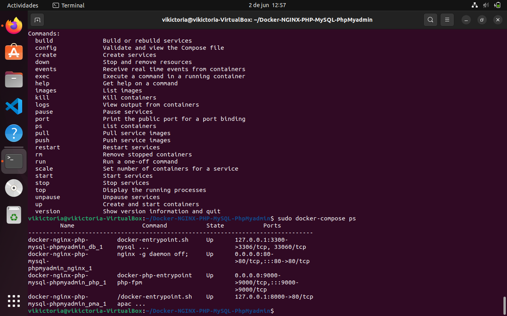
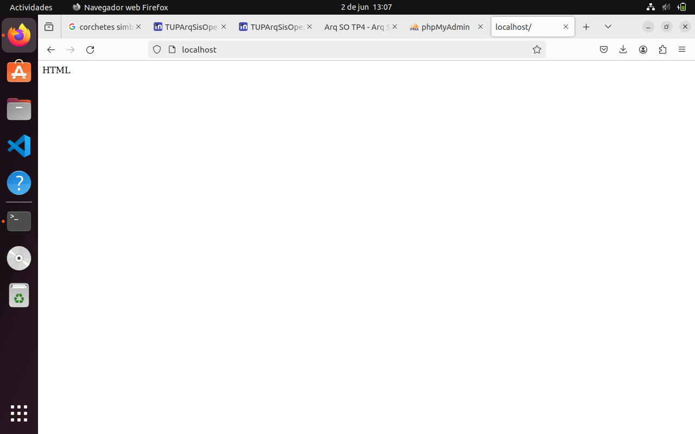
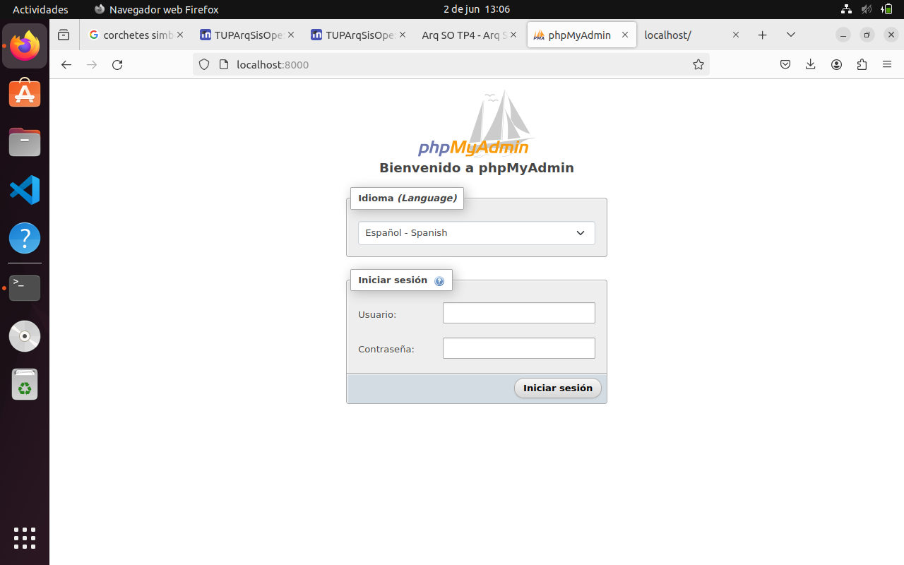
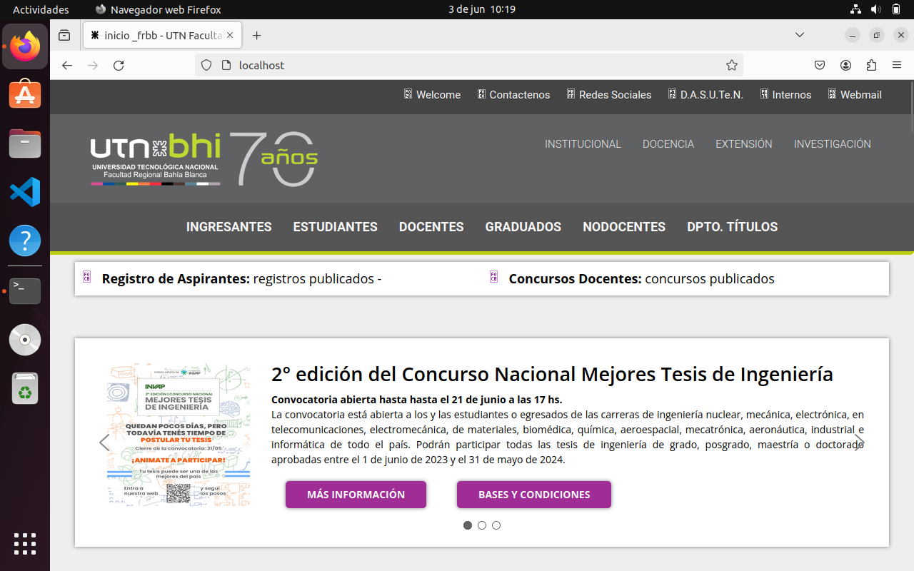

# Trabajo práctico N°3
1) Ejecutar varias veces los códigos escritos en Python: sinhilos.py y
conhilos.py
a) ¿Qué se puede notar con respecto al tiempo de ejecución? ¿Es
predecible?
en sinhilos.py el tiempo promedio es de 5.5 segundos, mientras que en conhilos.py es de 4.0, no es predecible ya que la mayoria de las veces dio un numero de segundos diferentes. 
b) Comparar con un campañero el tiempo de ejecución. ¿Son iguales?
no, no son iguales, a todos nos dio diferente
c) Ejecutar el archivo suma_rasta.py unas 10 veces, luego descomentar
(borrar el #) las líneas 11,12,19 y 20 guardarlo y ejecutarlo otras 10
veces. ¿Qué pasó? ¿Por qué?
despues de descomentar las lineas de codigo, vario el tiempo de ejecucion y los resultados, que al principio eran siempre 0, dan todos un numero diferente
posiblemente, el codigo no esta funcionando correctamente.

2) a) 
<a href="./TP3/con_race_condition.c">codigo resuelto </a>

b) 

# Trabajo práctico N°4

## 4-a

## 4-b

## 4-c
